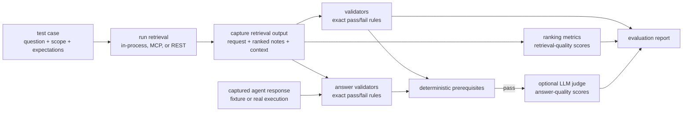
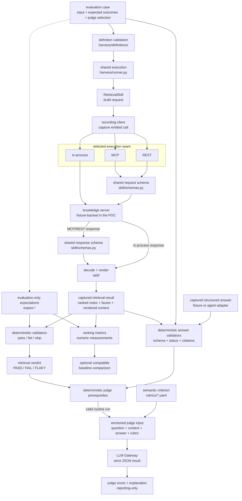
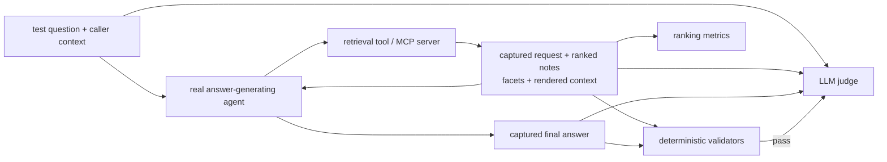

# Evaluation architecture

## Scope of the current POC

The current system evaluates a **retrieval skill**, not a complete answer-generating
agent. A retrieval execution returns ranked notes, facets, and agent-visible rendered
context. It does not return a natural-language answer to the user's question.

Generated-answer expectations and selected judge rubrics live in the same case under
`answer_evaluation`. The POC loads the captured response from
`fixtures/agent_responses/`; the repository does not yet contain the connector that
runs a real answer-generating agent.

## High-level flow



In plain language:

1. Load a well-formed test case containing the question, retrieval scope, and expected
   behaviour.
2. Run retrieval through the selected transport and capture what was requested and
   what came back.
3. Use deterministic validators for exact rules and ranking metrics for retrieval
   quality.
4. Optionally combine the retrieved context with a generated answer and ask an LLM
   judge to score semantic answer quality.
5. Report validator outcomes, ranking measurements, and judge scores separately.

The retrieval test itself still produces notes and context only. Synthetic captured
responses exercise deterministic answer checks and judge routing. In the target flow,
the capture comes from the real agent.

## Complete test flow



The branches answer different questions and are deliberately not averaged together:

| Branch | Question | Result | Can currently fail deterministic evaluation? |
| --- | --- | --- | --- |
| Definition validation | Is the test data well formed? | Valid definition or error | Yes, before execution |
| Deterministic validators | Did an exact contract or invariant hold? | Pass, fail, or skip | Yes |
| Ranking metrics | How good was the ordered result set? | Recall, precision, MRR, NDCG | Only through the CLI baseline comparison |
| LLM judge | Is a generated answer semantically good? | Score and explanation | No; reporting-only |

## 1. Retrieval test input

A file in `cases/` contains both execution input and evaluation-only expectations.
`harness/definitions/cases.py` rejects missing required fields, unknown keys, malformed
case filenames, invalid grades, and duplicate relevance labels before the retrieval
skill is called. The filename stem becomes the internal case ID.

[CASE_TEMPLATE.md](CASE_TEMPLATE.md) is the canonical authoring reference for every
supported case field, value, default, and applicability rule.

| Case data | Purpose | Sent to the retrieval skill or server? |
| --- | --- | --- |
| `query` | User's retrieval question | Yes |
| `caller.department`, `caller.product` | Retrieval scope | Yes, as `scope` |
| `filters` | Domain, veracity, validity, and memory-type constraints | Yes |
| `k` | Maximum number of results | Yes |
| `format` | `brief`, `full`, or `citations_only` | Yes |
| `expect_tool_call` | Optional exact request override | No; validator input only |
| `expect.relevant` | Graded retrieval reference labels | No; metric input only |
| `expect.must_not_return` | Forbidden note IDs | No; validator input only |
| `expect.expected_first_result` | Required first note | No; validator input only |
| `answer_evaluation.expect` | Exact status and citation expectations for the final answer | No; answer-validator input only |
| `answer_evaluation.rubrics` | Semantic criteria selected for this case | No; judge routing only |
| `answer_evaluation.reference_answer` | Optional reviewed comparison answer | No; judge input only |
| `probe_invalid_request` | Deliberately malformed boundary request | Sent separately, directly to MCP or REST |
| Case filename, `title`, `why` | Evaluation identity and purpose | No |

Authenticated caller identity is not yet represented in the case or request. Caller
identity propagation and server-side authorization cannot be claimed as tested until
the approved request schema defines that representation.

## 2. Request construction and schema enforcement

`RetrievalSkill` turns case input into this transport-neutral request:

```json
{
  "tool": "knowledge_retrieve",
  "args": {
    "query": "how do we handle retries on payment failures?",
    "scope": {
      "department": "commerce",
      "product": "shop"
    },
    "filters": {
      "veracity": ["verified"],
      "validity": "current"
    },
    "k": 10,
    "format": "full"
  }
}
```

The recording client captures this call before forwarding it. That captured call is
what `contract:emitted_tool_call` validates; the harness does not infer what was sent
from the response.

There are two representations of the retrieval contract:

| Boundary | Contract | Responsibility |
| --- | --- | --- |
| Skill internals | Dataclasses in `skill/contracts.py` | Validate nonblank query, positive `k`, allowed format, and the closed filter vocabulary; build the exact tool call |
| MCP and REST wire | Pydantic models in `skill/schemas.py` | Publish one shared request/response shape, reject extra fields, and enforce wire field types |

Execution mode determines where the request crosses a schema boundary:

1. `inprocess` calls the fixture-backed server through Python objects. It exercises
   skill request construction but not a protocol boundary.
2. `mcp` sends the arguments through the MCP tool schema.
3. `rest` sends the same shape as a REST JSON body.

MCP and REST both import `skill/schemas.py`; they do not maintain independent copies
of the contract. A case with `probe_invalid_request` bypasses the skill and sends its
malformed request directly to one of these protocol boundaries. This proves rejection
by the server-facing contract rather than only by trusted client code.

## 3. Retrieval output and captured execution record

The server response has this wire shape:

```json
{
  "results": [
    {
      "note_id": "n-0001",
      "version": 3,
      "title": "Idempotency guarantees in the settlement path",
      "claim": "Settlement writes are idempotent...",
      "veracity": "verified",
      "valid_to": "2026-12-31",
      "source_system": "github",
      "source_locator": "acme/payments#docs/settlement.md",
      "source_version": "a1b2c3d",
      "score": 0.82
    }
  ],
  "facets": {
    "product": {"shop": 1},
    "veracity": {"verified": 1}
  }
}
```

`RetrieveResponseOut` requires `results` and `facets`. Every result must contain the
note identity and version, claim, veracity, validity, original-source provenance, and
retrieval score. Extra output fields are rejected at MCP and REST boundaries.

The skill decodes the response into the transport-independent objects in
`skill/contracts.py`, then `skill/formatter.py` derives human-readable `rendered`
context. The rendered value is what a future answer-generating agent would consume:

```text
### Knowledge — 3 notes · scope commerce/shop
1. Payment failure taxonomy [verified]
   > "Payment failures are classified..."
   note n-0002@1 · source confluence:PAY-4412@7
```

It is **retrieved context, not the final answer**.

The runner captures an evaluation record containing:

- ranked note IDs;
- the structured results and facets;
- the rendered context;
- the original query, caller, and filters;
- the exact emitted tool call and call count;
- every validator outcome and its traceability source;
- ranking metrics where relevance labels exist;
- the final deterministic verdict.

## 4. Deterministic validators

Definitions answer “is the test itself valid?” Validators answer “did the executed
system behave correctly?” Each runtime validator is registered with a requirement
source and records `ok`, `fail`, or `skip`.

| Validator | Input inspected | Applicability | What failure means |
| --- | --- | --- | --- |
| `contract:emitted_tool_call` | Captured request and case input | Every case | Query, scope, filters, limit, format, or tool name changed or was dropped |
| `contract:server_rejects_invalid_request` | Direct malformed probe and server response | Cases with `probe_invalid_request`; MCP/REST only | The server trust boundary accepted invalid input or rejected it for the wrong reason |
| `contract:response_contract_valid` | Decoded response or retrieval error | Every case | No valid response was decoded, or required output is missing, renamed, extra, or wrongly typed |
| `retrieval:must_not_return` | Ranked note IDs and `expect.must_not_return` | When declared | Forbidden, superseded, unverified, or out-of-scope knowledge leaked |
| `retrieval:expected_first_result` | First ranked note and the declared expectation | When declared | The explicitly authoritative result did not rank first |
| `format:every_result_has_provenance` | Rendered context and structured results | Every execution with a response | A note-version or original-source reference was lost during formatting |

Any failed validator adds an invariant failure and makes the case fail. When the CLI
repeats a case, all passes produce `PASS`, all failures produce `FAIL`, and mixed
results produce `FLAKY`. A skipped check is visible but is not treated as a pass;
for example, invalid-request rejection is skipped in `inprocess` mode because no
protocol trust boundary exists there.

## 5. Ranking metrics

Ranking metrics compare the returned note order with `expect.relevant`. These labels
are test oracle data and are never sent to the retrieval system.

```text
returned ranked note IDs + per-query relevance grades
                         ↓
       Recall@k, Precision@5, MRR, NDCG@k
```

Grades `1` and `2` count as relevant. NDCG additionally gives grade `2` more gain than
grade `1`. Unlisted notes are currently treated as irrelevant. `must_not_return` is
not a grade: it is a zero-tolerance deterministic invariant.

| Metric | Business meaning | Current calculation |
| --- | --- | --- |
| Recall@k | Did retrieval find all known useful knowledge needed by the agent? | Notes graded `1` or `2` found in the first `k` results, divided by all notes graded `1` or `2`. `k` comes from the case. |
| Precision@5 | How much of the first five context positions is useful rather than noise? | Notes graded `1` or `2` in the first five positions, divided by `5`. Missing positions and unlisted notes count as not relevant. |
| MRR | How quickly does the agent encounter its first useful result? | `1 / rank` of the first note graded `1` or `2`; `0` when no relevant note is returned. |
| NDCG@k | Are the best notes presented before weaker and irrelevant notes? | Discounted gain of the returned ranking through `k`, divided by the best possible ranking for the same labels. |

| Grade | Meaning | How metrics use it |
| --- | --- | --- |
| `2` | Directly answers the question | Relevant for every metric; higher gain in NDCG |
| `1` | Materially useful but insufficient on its own | Relevant for every metric; lower gain in NDCG |
| `0` | Not relevant | Not relevant for every metric |
| Unlisted | No relevance label exists for the note in that case | Currently treated as not relevant |

`run_case()` calculates the metrics whenever a case declares `expect.relevant`.
Pytest currently verifies
the `ranx` adapter with explicit known examples; it does not apply a per-case metric
threshold. The CLI can compare calculated metrics with a compatible baseline, and a
regression beyond tolerance can affect the CLI exit status without changing the
deterministic validator verdict.

### Run manifest and compatible baseline comparison

Each CLI run records a versioned manifest rather than treating every recorded version
as one undifferentiated fingerprint:

```text
compatibility inputs     target under evaluation       run metadata
must match               may differ when declared      traceability only
        \                       |                         /
         +---------------- baseline comparison --------+
```

The compatibility section records the evaluation profile and level, corpus content,
case and relevance-label content, request/response contracts, orchestration code,
dependency lock, transport, execution count, environment class, index and embedding
configuration, vocabulary, ontology, permission policy, and the result-family
measurement definition. The target section records the Knowledge Server, Retrieval
Skill, graph/vector store, index build, and retrieval configuration versions. The run
section records values such as execution time that support attribution but do not
invalidate a functional comparison.

Target differences are rejected unless the current run declares the exact
`target.<field>` as its `change_under_test`. Controlled inputs cannot be waived this
way. This allows a server upgrade to be evaluated while preventing an unnoticed
corpus, case, contract, dependency, or measurement change from being attributed to
that upgrade.

Compatibility is result-specific. The implemented CLI comparison uses the ranking
profile and additionally requires identical case IDs and per-case metric names.
Added, removed, renamed, or newly applicable cases or metrics require a new reviewed
baseline; the runner never compares only their intersection. Unknown manifest
versions, missing required fields, undeclared target changes, and malformed baseline
files are rejected before metric deltas are calculated.

The current synthetic target supplies explicit fixture values. A real Knowledge
Server integration supplies the same manifest fields through system metadata,
including its build, corpus/index snapshot, store, embedding, schema, semantic-asset,
retrieval-configuration, and permission-policy versions. Recording the first approved
real baseline is separate from this comparison mechanism.

The integration metadata has this shape:

```json
{
  "compatibility": {
    "evaluation_level": "integration",
    "environment_class": "production-read-only",
    "corpus_snapshot": "knowledge-repo@8f31c2a",
    "index_schema_version": "graph-v4",
    "chunking_version": "chunks-v2",
    "embedding_model": "approved-embedding-deployment",
    "embedding_model_version": "2026-08-01",
    "embedding_dimensions": 1536,
    "vocabulary_version": "vocabulary@17",
    "ontology_version": "ontology@9",
    "permission_policy_version": "retrieval-policy@12"
  },
  "target": {
    "knowledge_server_version": "2.4.0",
    "retrieval_skill_version": "1.8.0",
    "graph_vector_store": "selected-store",
    "graph_vector_store_version": "reported-version",
    "index_build_id": "index-2026-08-28-01",
    "retrieval_configuration_version": "hybrid-retrieval-v3"
  },
  "run": {
    "environment": "production",
    "region": "reported-region",
    "trace_id": "evaluation-trace-id"
  }
}
```

## 6. Generated-answer evaluation

The judge evaluates answer quality, not retrieval ranking. A case's optional
`answer_evaluation` section declares exact answer expectations, applicable semantic
rubrics, and an optional reference answer. It does not contain a generated answer.
The POC pairs the case with a structured response from `fixtures/agent_responses/`.
A real integration supplies the response and retrieval trace from the agent execution
instead. `evaluate_agent_response()` never reruns retrieval.

The provisional response contract contains:

```json
{
  "status": "answered",
  "answer": "Only retryable payment failures may be retried...",
  "citations": [
    {"note_id": "n-0002", "version": 1}
  ]
}
```

Five deterministic answer validators check the response contract (including nonblank
text), structured status, citations actually retrieved, required citations, and
forbidden citations. Their outcomes join the retrieval verdict in one `AgentRun`.

`run_agent_judges()` uses the question, context, and answer already present in that
captured run. Routine judging produces explicit `not_run` outcomes when retrieval or
answer prerequisites failed. `judge_failed_runs=True` is a deliberate diagnostic
override for structurally usable failures. Otherwise it runs exactly the rubrics
listed in the case's `answer_evaluation.rubrics`, in declaration order. No rubric is
inferred or suppressed from response status or reference data.

| Criterion | Case-author selection guidance | Question it answers |
| --- | --- | --- |
| Faithfulness | Select when the expected answer status is `answered`. | Is every answer claim supported by the retrieved context? |
| Answer correctness | Select when the case supplies a reviewed reference answer. | Does the generated answer agree with the reviewed reference answer? |
| Relevancy | Select when answer-to-question relevance should be scored. | Does the generated answer directly and sufficiently address the user's question? |

For each rubric, the runner builds this `JudgeInput`:

```json
{
  "case_id": "case-001-retries-ranking",
  "criterion": "faithfulness",
  "question": "how do we handle retries on payment failures?",
  "retrieved_context": "<rendered notes and provenance>",
  "generated_answer": "Only retryable payment failures may be retried...",
  "reference_answer": "<reviewed comparison answer>"
}
```

The versioned prompt adds the selected rubric's description and anchored scoring
criteria. Evaluation data is labelled as untrusted so instructions inside retrieved
content or an answer are not followed. Relevance labels, deterministic validator
outcomes, ranking metrics, forbidden-note expectations, and baseline results are not
sent to the LLM judge.

### Gateway request and result schema

The Gateway receives the model ID, complete prompt, `temperature: 0`, `store: false`,
and a strict JSON Schema. `LLM_GATEWAY_TOKEN` is sent only as the HTTP Bearer
credential, never inside the prompt.

The model must return exactly:

```json
{
  "criterion": "faithfulness",
  "score": 1.0,
  "explanation": "Every answer claim is supported by the retrieved notes."
}
```

The output schema forbids additional fields, restricts `criterion` to the requested
rubric, constrains `score` to `0..1`, and requires a nonblank explanation. Malformed
structured output fails the judge execution.

The saved judge record also contains requested and actual model IDs, model version,
prompt version, temperature, hashes of the prompt, rubric and input, cache key,
Gateway response ID, usage, cache status, and whether the underlying retrieval
execution passed.
Identical inputs and versions reuse the content-addressed cache.

Rubric thresholds are present in rubric definitions but do not currently gate pytest,
the retrieval verdict, metrics, baseline comparison, or process exit status. Normal
pytest uses a fake Gateway; `pytest --judge` explicitly enables the live call.

## 7. How pytest executes the architecture

Pytest is an orchestration and reporting layer over the same `run_case()` function
used by the harness runner:

1. `test_01_definitions.py` loads cases, their optional answer-evaluation sections,
   response fixtures, and rubrics and rejects invalid test data.
2. The session-scoped `case_executions` store in `harness/execution.py` executes
   lazily by case and caches each capture. Its POC provider runs fixture-backed
   retrieval and loads a saved answer when needed; a real provider will invoke the
   agent and capture both outputs.
   `test_02_retrieval.py` reports retrieval validators over the captured result.
3. `captured_runs` converts each answer-enabled execution into the shared input for
   `test_03_answer.py`, which applies exact answer validators and judge prerequisites.
4. `test_04_ranking.py` reports each metric calculated for a case with relevance
   labels and checks the metric adapter against explicit known rankings, including
   empty retrieval.
   Metrics have no per-case pytest quality threshold yet.
5. `test_05_judges.py` consumes the same captured runs and exercises prompt
   construction, strict output parsing, caching, and reporting. Tests marked `judge`
   are deselected unless `--judge` is supplied; only those opt-in tests may call the
   configured live model.

Evaluation items are collected case-first. Within each case, verbose pytest output
follows definition, request, response, expectation, answer, ranking, and judge order.
Case-driven parameter IDs use `case:level:check`; `suite` identifies repository-wide
checks, while `synthetic` identifies tests of the harness rather than a retrieval
scenario. Selecting one case with `-k` does not execute the others.

Pytest markers separate the two meanings of success:

- `pytest -m framework` verifies loaders, validators, metric calculations, judge
  plumbing, and committed evaluation assets.
- `pytest -m evaluation` reports only declared case outcomes for the selected target.

The unfiltered `pytest` command runs both categories. `--transport` and `--judge` can
be combined with `-m evaluation` without changing case definitions.

Framework tests use fixed local synthetic inputs rather than `case_executions`, so
they cannot accidentally invoke a real target and may use pytest-xdist. Case-driven
evaluation and live-judge runs must remain single-process: xdist would give each
worker its own session cache and could execute the same real case more than once.
Pytest therefore accepts `-n` only with the exact `-m framework` selection.

The default transport is `inprocess`. Selecting `--transport mcp` or
`--transport rest` runs the same case definitions across a protocol boundary and
makes the invalid-request validators applicable.

## 8. Target end-to-end flow with the real agent

The captured-run evaluator and judge routing now exist. When the answer-generating
agent is connected, an adapter must supply both its retrieval trace and final answer:



In that architecture:

1. The retrieval trace remains the input to deterministic validators and ranking
   metrics.
2. The actual final answer replaces the structured response fixture for live runs.
3. The judge receives the original question, the context actually available to the
   agent, and the answer actually returned by the agent.
4. Judge scores remain separate from exact contract failures unless an explicit,
   reviewed gating policy is introduced.

## 9. Ownership map

| Concern | Current owner |
| --- | --- |
| Case shape, reference labels, answer expectations, and rubric selection | `cases/*.yaml`, `harness/definitions/cases.py` |
| Synthetic agent-response fixtures | `fixtures/agent_responses/*.yaml`, `harness/definitions/agent_responses.py` |
| Rubric shape and content | `rubrics/*.yaml`, `harness/definitions/rubrics.py` |
| Internal request/response objects | `skill/contracts.py` |
| Shared MCP and REST wire schemas | `skill/schemas.py` |
| Request construction and response rendering | `skill/skill.py`, `skill/formatter.py` |
| MCP and REST server boundaries | `server_mcp.py`, `server_rest.py` |
| Transport clients and emitted-call capture | `skill/client.py` |
| Shared execution and retrieval record | `harness/runner.py` |
| Lazy one-execution-per-case storage and captured views | `harness/execution.py` |
| Provisional agent response and captured-run evaluation | `harness/agent/*.py` |
| Deterministic validators and traceability | `harness/validators/*.py` |
| Ranking measurements | `harness/ranking_metrics.py` |
| Judge prompt, schema, Gateway, cache, and record | `harness/judges/*.py` |
| Pytest orchestration and reporting | `tests/*.py` |
