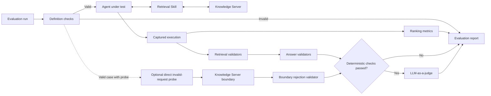
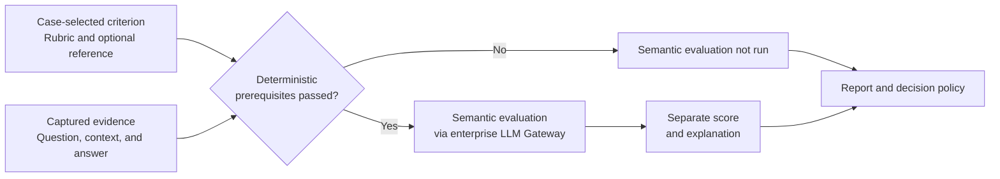

# Context Engineering Retrieval and Agent Evaluation Process

## Status

**Draft — work in progress.** This document defines the retrieval and agent read-path
evaluation process, the first component-specific reference implementation of the
Context Engineering platform evaluation strategy. It also identifies the substitutions
used by the current proof of concept.

Process approval: **TBD**.

## Purpose

The process executes a defined evaluation case, captures retrieval and answer evidence
from one agent execution, applies exact validation first, measures retrieval quality,
and uses an LLM judge only for case-selected semantic criteria. It reports
deterministic outcomes, ranking metrics, and judge scores separately.

## High-level process



## Detailed process

```mermaid
flowchart LR
    RUN["Evaluation run"]
    DEFINITIONS["Definition checks<br/><br/>• runtime inputs and expected outcomes<br/>• relevance labels when used<br/>• semantic criteria when used"]
    DEFINITIONS_VALID{"Definitions<br/>valid?"}
    DEFINITION_FAILURE["Stop before target execution<br/>Report definition failures"]
    CASE["Execute evaluation case<br/><br/>Send the question<br/>and permitted runtime inputs"]
    AGENT["Agent under test<br/><br/>Interpret question<br/>Request context<br/>Produce final answer"]
    SKILL["Retrieval Skill<br/><br/>Translate the context need<br/>into a structured request<br/>Preserve returned provenance"]
    SERVER["Knowledge Server<br/><br/>Validate request and caller<br/>Return ranked notes<br/>or retrieval error"]
    CAPTURE["Capture one execution<br/><br/>• emitted retrieval request<br/>• retrieval response and context<br/>• final structured answer"]
    RET["Retrieval validators<br/><br/>• request and boundary contracts<br/>• safety and case expectations<br/>• result provenance"]
    ANSWER["Answer validators<br/><br/>• response contract<br/>• expected status<br/>• citation requirements"]
    METRICS["Ranking metrics<br/><br/>• Recall<br/>• Precision<br/>• MRR<br/>• NDCG"]
    PROBE["Optional invalid-request probe<br/><br/>Separate execution that bypasses the agent"]
    PROBE_SERVICE["Knowledge Server boundary"]
    PROBE_RESULT["Capture rejection or unexpected acceptance"]
    PROBE_VALIDATOR["Boundary rejection validator"]
    VALID{"Deterministic<br/>checks passed?"}
    SKIP["Do not run routine LLM judge<br/>Report deterministic failures"]
    JUDGE["LLM-as-a-judge<br/><br/>Run exactly the rubrics selected by the case"]
    REPORT["Report separately<br/><br/>• deterministic outcomes<br/>• ranking metrics<br/>• applicable judge scores"]

    RUN --> DEFINITIONS --> DEFINITIONS_VALID
    DEFINITIONS_VALID -->|No| DEFINITION_FAILURE --> REPORT
    DEFINITIONS_VALID -->|Yes| CASE --> AGENT
    AGENT -->|Context request| SKILL
    SKILL -->|Structured retrieval request and caller identity| SERVER
    SERVER -->|Ranked context or error| SKILL
    SKILL -->|Context with provenance| AGENT
    AGENT -->|Final structured answer| CAPTURE
    CASE -.->|When declared| PROBE
    PROBE -->|Malformed request| PROBE_SERVICE --> PROBE_RESULT --> PROBE_VALIDATOR
    CAPTURE --> RET --> ANSWER --> VALID
    PROBE_VALIDATOR --> VALID
    CAPTURE --> METRICS --> REPORT
    VALID -->|No| SKIP --> REPORT
    VALID -->|Yes| JUDGE --> REPORT
```



## Define the evaluation

Before executing the target, the evaluation definition must provide complete,
version-controlled, and internally consistent:

- runtime inputs and expected outcomes;
- retrieval expectations and relevance labels when ranking is measured;
- answer expectations and semantic criteria when answer quality is evaluated.

Invalid definitions stop execution before the target is called. Framework validation
of synthetic POC assets remains separate from target evaluation.

## Execute and capture

The process executes the case through:

```text
Agent → Retrieval Skill → Knowledge Server
```

It captures the request emitted by the Retrieval Skill, the Knowledge Server response,
the context presented to the agent, and the agent's final answer from the same
execution.

Invalid-request cases are executed separately against the Knowledge Server boundary,
bypassing the agent and Retrieval Skill. This isolates server contract enforcement
from agent behaviour.

## Evaluate the captured evidence

| Evaluation layer | Question answered | Method | Result |
| --- | --- | --- | --- |
| Deterministic retrieval validation | Did retrieval satisfy its contracts, safety requirements, provenance, and exact case expectations? | Exact validation | Pass, fail, or not applicable |
| Deterministic answer validation | Did the answer satisfy its contract, status, and citation requirements? | Exact validation | Pass, fail, or not applicable |
| Retrieval ranking | Did retrieval find and order useful knowledge effectively? | Recall, Precision, MRR, and NDCG | Separate measurements |
| Semantic answer quality | Is the answer supported, relevant, and correct? | Case-selected LLM rubrics | Separate scores and explanations |

### Semantic answer quality

Semantic answer evaluation addresses quality questions that cannot be determined
reliably through exact comparison. It runs only after deterministic retrieval and
answer requirements pass.



The evaluation case selects the applicable criteria:

- **Faithfulness** — Is the answer supported by the context retrieved during the same
  execution?
- **Relevancy** — Does the answer directly and sufficiently address the user's
  question?
- **Answer correctness** — Does the answer agree with an approved reference answer
  when one is available?

The evaluation uses the original question, retrieved context, generated answer, and
optional reference answer. Each criterion produces a separate score and explanation.
The judge model, model version, prompt, rubric, result schema, and sampling
configuration are fixed and recorded; the current implementation uses temperature
`0` and includes it in the judgment's cache identity.

Semantic results cannot override deterministic failures. They remain reporting-only
until score thresholds and a release-gating policy are approved.

Ranking metrics are reported independently and do not determine whether routine
judging runs.

Exact validator applicability, relevance grades, metric formulas, rubric definitions,
and judge inputs are maintained in the repository documentation rather than repeated
on this process page.

## Quality dimensions addressed by this process

| Quality dimension | Retrieval-process coverage |
| --- | --- |
| Data quality and trust | Provenance, unsafe-result, superseded-knowledge, and citation validation |
| Retrieval quality and grounding | Recall, Precision, MRR, NDCG, faithfulness, relevancy, and answer correctness |
| Reproducibility | One captured execution, versioned evidence, repeated runs, and compatible baselines |
| Enterprise integration | Protocol boundaries are represented; real enterprise dependencies and services are **TBD** |
| Security and permission fidelity | Declared scope and unsafe-result validation are represented; authenticated identity and server-derived permissions are **TBD** |
| Observability and traceability | Per-case evidence and results are represented; production telemetry is **TBD** |
| Performance, scalability, and reliability | Measure end-to-end and component latency, throughput, concurrency, error rates, timeouts, and graceful degradation through a separate performance and reliability process; not covered by the current functional POC |
| Context freshness, token and context efficiency, and adoption | Addressed through other component or cross-cutting evaluation processes; not covered by the current functional POC |

## Evaluation levels and execution modes

| Level | Retrieval-process application | Current position |
| --- | --- | --- |
| Framework | Evaluation instrument | Implemented with controlled synthetic assets |
| Component | Retrieval Skill against a controlled target | Implemented with a fixture-backed target |
| Contract | Knowledge Server MCP, REST, and CLI boundaries | MCP and REST implemented in memory; CLI **TBD** |
| Integration | Retrieval Skill, Knowledge Server, identity, storage, and enterprise services | **TBD** |
| End-to-end | Real agent with the complete retrieval path and captured final answer | **TBD** |
| Production observation | Retrieval regressions, incidents, drift, and operational targets | **TBD** |

Framework tests verify the measuring instrument using controlled synthetic assets.
Evaluation tests describe the selected target. Evidence and baselines from framework,
component, contract, integration, end-to-end, and production levels are not
interchangeable.

## Decide and report

For each case, the process reports:

- definition failures that prevent execution;
- deterministic validator outcomes and their requirement sources;
- the deterministic verdict;
- ranking metric values and observed distributions for repeated runs;
- applicable LLM-judge scores, explanations, and recorded versions;
- explicit outcomes where deterministic prerequisites block judging.

Each report records a versioned run manifest that separates controlled compatibility
inputs, the target under evaluation, and traceability-only run metadata. Comparisons
reject changed evaluation data, contracts, measurement code, dependencies,
configuration, cases, or metrics before calculating deltas. A target version may
differ only when the exact field is declared as the change under test. Approved
release thresholds and the first real baseline remain **TBD**.

### Decision and operating rules

- Invalid definitions stop target execution.
- A deterministic validator failure fails the applicable evaluation and cannot be
  overridden by a metric or AI-judge score.
- Ranking metrics remain reporting and baseline-comparison results until thresholds
  and release gates are approved.
- LLM-judge results remain reporting-only until thresholds and a gating policy are
  approved.
- Baseline comparisons are valid only across compatible evaluation versions and
  levels. Added, removed, renamed, or newly applicable cases and metrics require a new
  reviewed baseline; comparisons never silently use only their intersection.
- The accountable process owner, development and release cadence, production cadence,
  and exception-approval process are **TBD**.

## Improve

Confirmed production retrieval incidents, ranking regressions, permission failures,
unsupported answers, and recurring answer-quality defects become version-controlled
evaluation cases with the triggering evidence attached. Defects in the evaluation
instrument itself become framework regression tests rather than target cases.

Production detection, triage ownership, and case-approval integration are **TBD**.

## Current POC boundary

| Current POC substitution | Intended integration |
| --- | --- |
| Fixture-backed retrieval | Real Knowledge Server |
| Direct Retrieval Skill execution | Real answer-generating agent |
| Synthetic final answer | Final answer captured from the same real execution |
| In-memory MCP and REST | Real MCP, REST/API, and CLI contract and integration boundaries |
| Fake judge Gateway by default | Approved enterprise Gateway integration |

The POC proves that the evaluation mechanism, protocol contracts, validators, ranking
measurements, deterministic answer checks, and judge routing work together. It does
not prove production retrieval quality or real-agent answer quality.

Production use requires approved contracts, reference labels, decision thresholds,
judge policy, authenticated permission fidelity, and the integrations declared by the
applicable evaluation levels. Load, latency, freshness, and monitoring are addressed
through integration, production-observation, or cross-cutting evaluation processes.

Broad enterprise model safety and approval of the underlying corpus and reference
labels remain separate strategy dependencies.

## Related page

- [Strategy Overview](STRATEGY_OVERVIEW.md)

## Source material

This process implements the Strategy Overview and is grounded in `README.md`,
`ARCHITECTURE.md`, `EVALUATION_FLOW.md`, and the platform `architecture/`
documentation.
