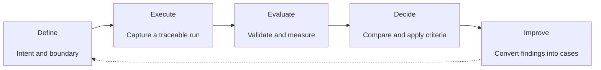
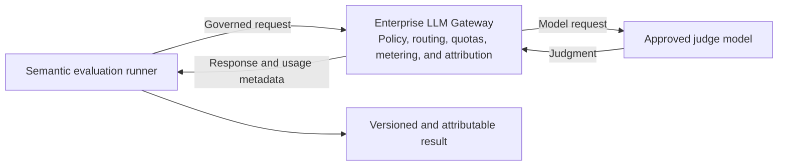

# Context Engineering Testing Strategy — Overview

## Status

**Draft — work in progress.**

Formal approval: **TBD**.

## Strategy intent

This strategy establishes a repeatable, case-driven evaluation process that detects
contract and invariant failures, unsafe behaviour, quality regressions, inconsistent
state changes, and semantic output issues. It captures what the system sends, returns,
and changes; evaluates exact requirements before semantic quality; and reports each
result type separately.

The Context Engineering platform evaluation strategy is established through a shared
set of evaluation principles and implemented first for the retrieval and agent read
path. Additional component-specific evaluation processes will extend the same
strategy across authoring, knowledge governance, ingestion, indexing, semantic
assets, reconciliation, security, reliability, and production operation.

## Scope

The complete architecture contains two primary paths:

```text
Write path
Source change → Trigger → Agent job → Knowledge repo → Ingestion → Queue → Index

Read path
Consumer → Retrieval Skill → Knowledge Server → Cache/Index → Assembled context
```

The shared strategy applies to both paths and their supporting identity, model-access,
storage, and operational services. It covers evaluation definitions, execution
boundaries, captured evidence, deterministic validation, quality measurement,
semantic evaluation, baseline comparison, release decisions, and feedback from
production operation. Each platform capability applies this strategy through its own
component-specific evaluation process.

This strategy does not replace a broad enterprise model-safety programme or the
governance process that approves the underlying knowledge corpus and reference labels.
It treats approved knowledge and evaluation references as controlled inputs.

## Evaluation approach

**Main principle: deterministic where possible, AI where necessary.**



### Flow requirements

| Phase | Required activities | Result |
| --- | --- | --- |
| Define | Specify evaluation intent, inputs, expected outcomes, target, environment, and execution boundary | Version-controlled evaluation definition |
| Execute | Run the target and capture calls, events, outputs, state changes, identity, configuration, and relevant versions | Traceable evaluation evidence |
| Evaluate | Validate exact contracts and invariants first; measure quality; use AI only for semantic criteria | Separate validation, measurement, and AI-judgment results |
| Decide | Preserve attribution, compare only compatible baselines, and apply approved release criteria | Explicit release or reporting decision |
| Improve | Convert production incidents, regressions, and observed failures into evaluation cases | Expanding regression coverage |

### Semantic evaluation

Semantic evaluation complements deterministic validation when an expected outcome is
based on meaning and cannot be represented reliably as an exact contract, value, state
transition, or invariant.



Each component-specific evaluation process declares the semantic criterion, the output
and supporting evidence being evaluated, any approved reference output, the rubric and
judge configuration, and the result's decision role.

Semantic evaluation runs only after its deterministic prerequisites pass. Each
criterion produces a separate, versioned, and attributable result. Semantic results
cannot override deterministic failures and do not gate releases until thresholds and
a decision policy are approved.

## Platform evaluation coverage

| Platform capability or concern | Evaluation objective |
| --- | --- |
| Retrieval Skill, Knowledge Server, and agent read path | Validate request construction, retrieval, grounding, provenance, ranking, and generated answers |
| Data-source and trigger integration | Validate supported change detection, authoritative source references, event context, and dispatch of the correct platform job |
| Authoring | Validate conversion of source changes into accurate, atomic, and traceable knowledge proposals |
| Knowledge repo and review gate | Validate atomic note structure, pinned provenance, version history, human approval, rollback, and prevention of unreviewed publication |
| Ingestion | Validate note contracts, taxonomy, provenance, authorization, and publication |
| Queue, Index writer workers, and Graph + vector index store | Validate queue processing, idempotency, graph/vector consistency, cache invalidation, and rebuildability |
| Semantic assets and scope resolution | Validate vocabulary and ontology contracts, alias resolution, scope inheritance, reviewed changes, version compatibility, dry-run impact, and affected-index re-resolution |
| Reconciliation | Validate detection and correction of stale, superseded, missing, or contradictory knowledge |
| Enterprise shared-service integration | Validate human and workload identity through Okta, exclusive model routing through the LLM Gateway, policy enforcement, isolation, metering, and attribution |
| Security and permission fidelity | Validate identity propagation, authorization, query-time filtering, and auditability |
| Reliability and production operation | Validate performance, dependency failures, graceful degradation, recovery, freshness, and monitoring |

## Component-process standard

Every component-specific evaluation process defines:

- its evaluation objective and the risks it addresses;
- the target component, environment, and execution boundary;
- inputs, expected outcomes, and controlled dependencies;
- calls, events, outputs, and state changes captured as evidence;
- deterministic contracts and invariants;
- quality measurements and any semantic criteria requiring AI;
- compatible baseline requirements and release criteria;
- execution cadence, ownership, and production-feedback handling.

The component process selects evidence and checks appropriate to its target. It does
not force authoring, knowledge governance, ingestion, indexing, semantic assets,
reconciliation, and retrieval into one identical execution flow.

## Evaluation levels

| Level | Purpose |
| --- | --- |
| Framework | Prove that the evaluation instrument, fixtures, validators, measurements, and judge routing work correctly |
| Component | Evaluate one platform component in isolation through a declared interface |
| Contract | Validate schemas, protocols, identity propagation, and error behaviour at a boundary |
| Integration | Evaluate connected platform components and enterprise services together |
| End-to-end | Evaluate a complete write or read path from its initiating input to its observable outcome |
| Production observation | Detect regressions, incidents, drift, and unmet quality targets in real operation |

Framework confidence remains separate from target-system quality. Evidence and
baselines from component, contract, integration, end-to-end, and production levels
are not interchangeable.

## Platform-wide quality dimensions

The strategy evaluates quality dimensions that span multiple components and cannot be
owned by a single component flow:

| Quality dimension | What the strategy evaluates |
| --- | --- |
| Scalability, performance, and reliability | Throughput, latency, concurrency, dependency failures, and graceful degradation |
| Data quality and trust | Accuracy, provenance, veracity, consistency, contradictions, and superseded knowledge |
| Retrieval quality and grounding | Whether relevant, permitted, and authoritative context is retrieved and supports the generated answer |
| Context freshness | Time from source change to retrievable context and exposure to stale knowledge |
| Reproducibility | Whether executions can be reconstructed and compared using compatible versions |
| Enterprise integration | Identity, Gateway, protocol, source-system, and operational-service boundaries |
| Security, privacy, and compliance | Authentication, permission fidelity, auditability, and sensitive-data handling |
| Token and context efficiency | Context size, useful-context density, token consumption, and cost |
| Developer experience and adoption | Integration effort, usability, repeat usage, and stakeholder satisfaction |
| Maintainability and versioning | Change effort and compatibility across contracts, prompts, policies, cases, and baselines |
| Time to value | Workflow time, human effort reduction, and delivery lead time |
| Observability and traceability | Reconstruction of the inputs, identity, context, sources, configuration, and models behind an outcome |

## Decision and operating model

Every component-specific evaluation process has an accountable owner and an approved
execution cadence for development, change validation, release, and production where
applicable. Its decision policy:

- identifies deterministic failures that have zero tolerance;
- defines approved thresholds for measurements and AI judgments before they gate a
  release;
- compares results only when targets, data, contracts, configuration, and evaluation
  versions are compatible;
- declares the target change being evaluated and rejects undeclared changes to either
  the target or the controlled evaluation inputs;
- keeps definition outcomes, deterministic validations, measurements, and AI
  judgments separate in reporting and decision-making;
- records and approves exceptions rather than silently weakening a requirement;
- converts production incidents, regressions, and observed failures into
  version-controlled evaluation cases.

## Reference implementation

The retrieval and agent read path is the first implementation of this strategy. Its
reference process covers:

- structurally valid, version-controlled evaluation cases;
- the request emitted by the Retrieval Skill and the Knowledge Server boundary;
- ranked results, response contracts, provenance, and exact retrieval expectations;
- the final structured agent answer, status, and citations;
- ranking quality measured against human-assigned relevance labels;
- semantic answer evaluation using case-selected LLM-judge rubrics;
- traceable reporting and separate baselines for distinct execution modes.

Its component-specific stages, validators, measurements, answer evaluation, execution
modes, and current POC substitutions are defined in the Retrieval and Agent Evaluation
Process.

## Related page

- [Retrieval and Agent Evaluation Process](EVALUATION_PROCESS_FLOW.md)

## Source material

This strategy is grounded in `README.md`, `ARCHITECTURE.md`, `EVALUATION_FLOW.md`, and
the platform `architecture/` documentation.
